# 🔥 FIREWATCH

**A real-time wildfire common operating picture: fuse camera + satellite + weather + terrain into
a continuously self-correcting probabilistic spread forecast, and turn it into human-in-the-loop
evacuation and resource decisions — validated by replaying real fires.**

FIREWATCH is deliberately *not* another wildfire detector. Detection is a commodity and just an
input. The contribution is **integration → assimilation → decision**: model the world as an
ontology of fires, sensors, and threatened assets; assimilate live observations into a *calibrated*
forecast; and drive auditable decisions with lead-time and uncertainty.

> **Status: working end-to-end** — on a reproducible offline synthetic replay, on live public data
> for a real active fire, *and* scored against a **pre-registered retrospective on a real historical
> fire** (2024 Park Fire) with GOES-observed ground truth. Terrain, fuels (ESA WorldCover / LANDFIRE),
> and wind (HRRR/NWS) are real; the learned spread surrogate and smoke segmenter are **real trained
> torch models** (`make train`). Numbers are labeled *synthetic* vs *real* throughout — honesty over
> hype is a project principle, not a slogan (see `CLAUDE.md`).

### The common operating picture

The COP board (MapLibre + deck.gl), driven entirely by public data through the ontology — Observe
(camera → detector → georeferenced front), Map (assimilated burn-probability bands, 90% region,
observations, threatened zones/roads, camera view-cones), and Decide (ranked evacuations, egress,
staging, exposure, NL query), with a time scrubber over the assimilation window:

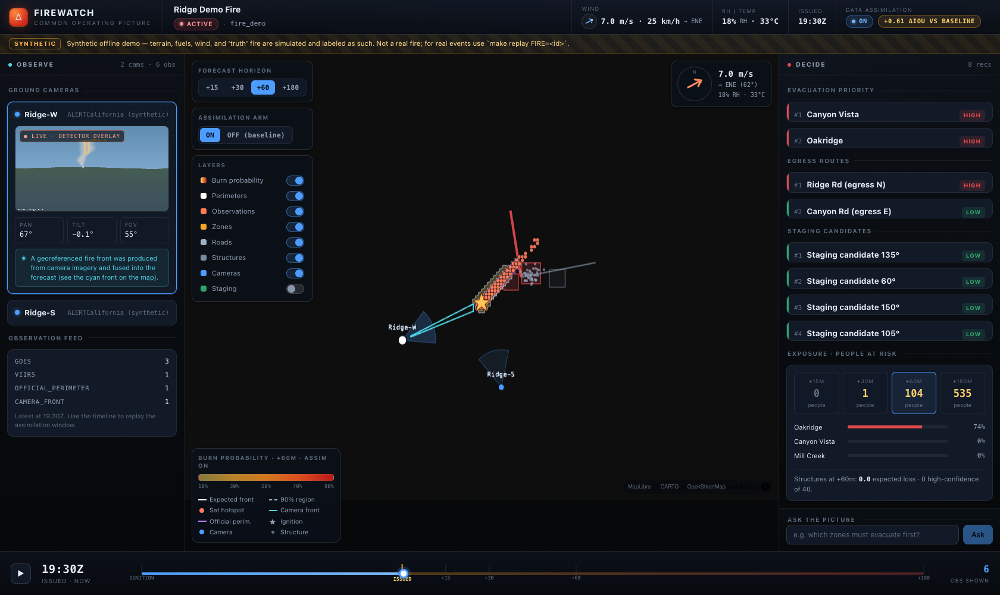

And the **same system on a real, currently-active fire** — located via NIFC, real terrain + NWS
wind + OSM assets, forecasting forward from the official perimeter (purple), with real egress routes
flagged by threat:

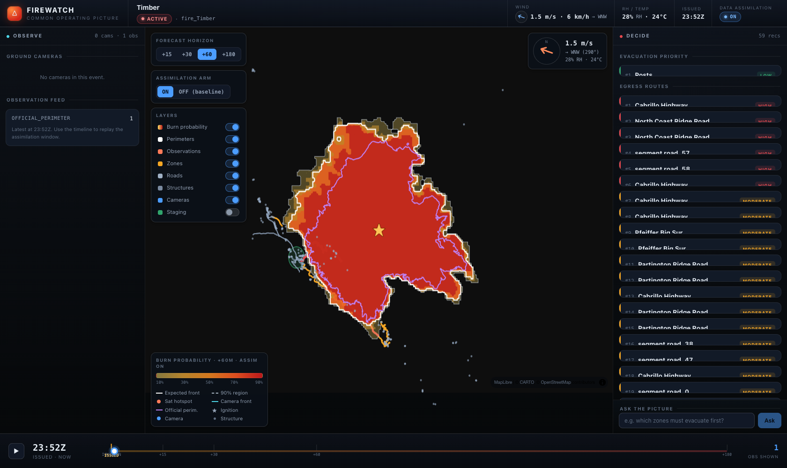

---

## Why this is different

Two research communities barely talk to each other:

- **Physics + data assimilation** can continuously correct a fire forecast from observations — but
  it's locked inside HPC-scale coupled atmosphere–fire simulators.
- **Data-driven ML** has accessible open datasets — but its models are single-shot, next-day,
  offline, and stop at a prediction map with no calibration and no decisions.

FIREWATCH bridges them: **a lightweight, real-time, single-GPU forecaster that assimilates fused
camera + satellite observations into a *calibrated* probabilistic perimeter, wrapped in a decision
layer.** None of the individual pieces are new; the bridge and the operational packaging are. See
[`docs/LITERATURE_REVIEW.md`](docs/LITERATURE_REVIEW.md) for the full, honest gap analysis.

## What it does

1. **Integrate** public feeds (NASA FIRMS, GOES active fire, NOAA HRRR, USGS DEM, LANDFIRE, NIFC
   perimeters, ALERTCalifornia cameras, OSM/Census assets) into one time-versioned **ontology**.
2. **Perceive** smoke/flame on tower cameras (YOLO/RT-DETR + SAM2, with a classical-CV fallback so
   the pipeline runs without a GPU).
3. **Georeference** the camera plume onto terrain → a fire front at **lat/lon + uncertainty cone**,
   with skyline self-calibration for imprecise PTZ tilt *(novelty 1)*.
4. **Forecast** spread with a Rothermel + minimum-travel-time ensemble that **assimilates**
   GOES/VIIRS/camera observations via a regularized particle filter → a calibrated burn-probability
   field at +15/+30/+60/+180 min that **sharpens as observations arrive** *(research core)*.
5. **Decide** — risk-to-population, evacuation lead-time, egress-route threat, staging — every
   recommendation traceable to its evidence, human-in-the-loop.

## Proof, not vibes

The whole point is measured skill + calibration, reproducibly:

| Metric | What it shows | Status |
|---|---|---|
| **Assimilation ON vs OFF** (perimeter IoU) | the central thesis: obs sharpen the forecast | **synthetic demo:** mean IoU **0.12 → 0.56** (+0.42 beyond last obs) · **real Park Fire (GOES truth):** **+0.02 at every horizon** (honest, modest — GOES is coarse) |
| **Calibration** (reliability, Brier, CRPS, coverage) | probabilities mean what they say | **measured** on demo *and* on the real retrospective (which honestly shows under-coverage of extreme spread) |
| **Georeferencing** ground error vs perimeter | camera→map is accurate enough to use | **measured:** 0 m clear-LOS round-trip; skyline self-cal cuts a 1.5° tilt error's 2370 m → ~0 m; 2-cam triangulation ~18 m |
| **Learned surrogate & smoke segmenter** | real torch models, not heuristics | **measured** (`make train`): surrogate **reached-cell MAE ~32 min**, **+60-min perimeter IoU 0.57**, **~10× faster** than MTT for a 48-member ensemble; smoke U-Net **val mask-IoU 0.94** (MPS) |
| **Evacuation lead-time delta** | the "moved-the-needle" number | **synthetic demo:** ~71 min earlier than baseline · real-fire lead-time needs a longer/finer (VIIRS) retrospective |

Everything regenerates from pinned inputs with one command:

```bash
make demo                    # fully-offline synthetic event, end-to-end, no keys, no network
make replay FIRE=<event_id>  # reproduce the full picture for a real fire
```

## Results (reproducible synthetic replay — run `make demo`)

*All figures below regenerate from pinned inputs; every synthetic artifact is labeled as such.*

**The thesis, measured — assimilation ON vs OFF** (perimeter IoU vs truth at each horizon), and the
COP preview where the assimilated forecast (red) tracks the truth perimeter (dashed) while the 90%
region (blue) stays appropriately wider:

| Assimilation ablation | Common operating picture (preview) |
|---|---|
| 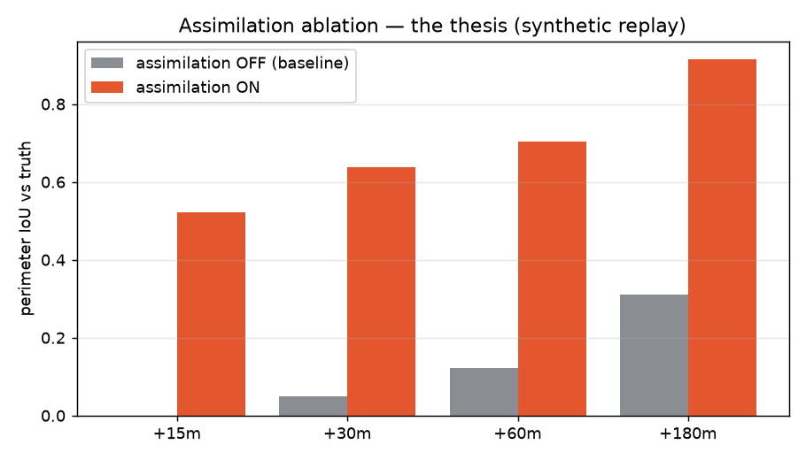 | 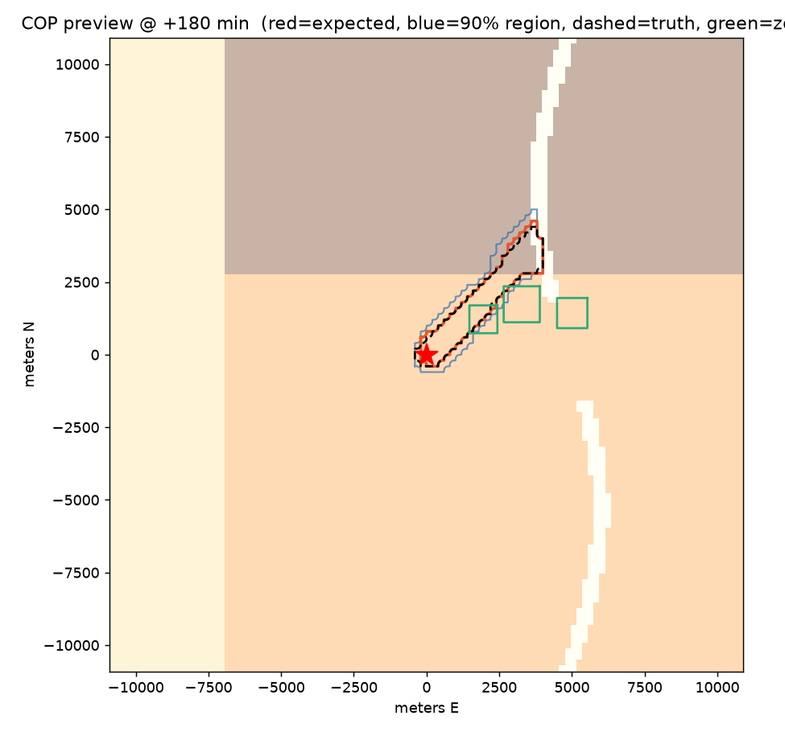 |

**Calibration is first-class** (reliability diagram + Brier, pre/post temperature scaling), and the
**forecast sharpens as observations arrive** (90%-region area shrinks, IoU rises with each cycle):

| Calibration / reliability | Sharpening over time |
|---|---|
| 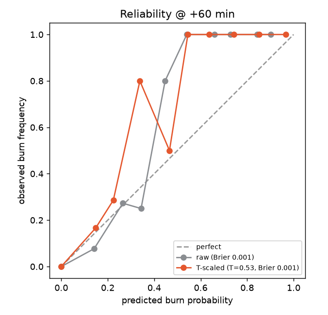 | 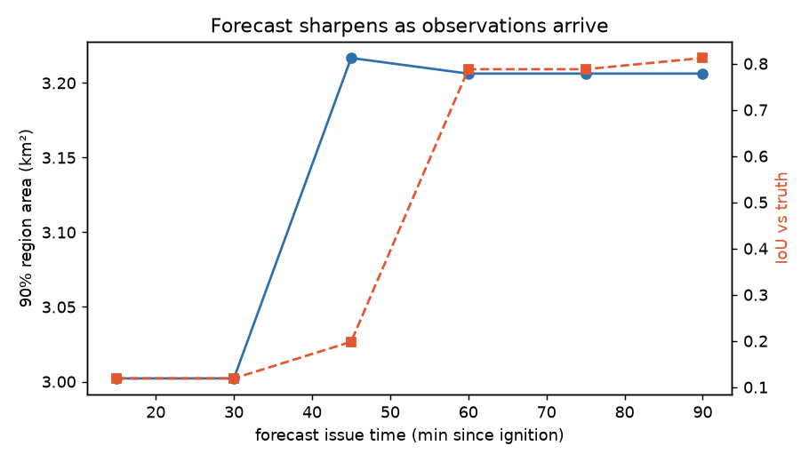 |

**Perception → georeference** on a tower-cam frame (detector box + SAM2-style plume mask + smoke-state
readout), and a **live COP on a real active fire** (the "Timber" fire, located via NIFC, real terrain
+ NWS wind, forecast forward from the current perimeter):

| Observe pane (camera) | Live real fire (Timber) |
|---|---|
| 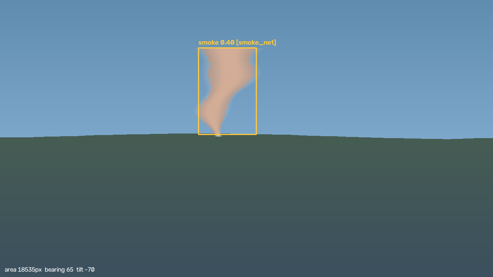 | 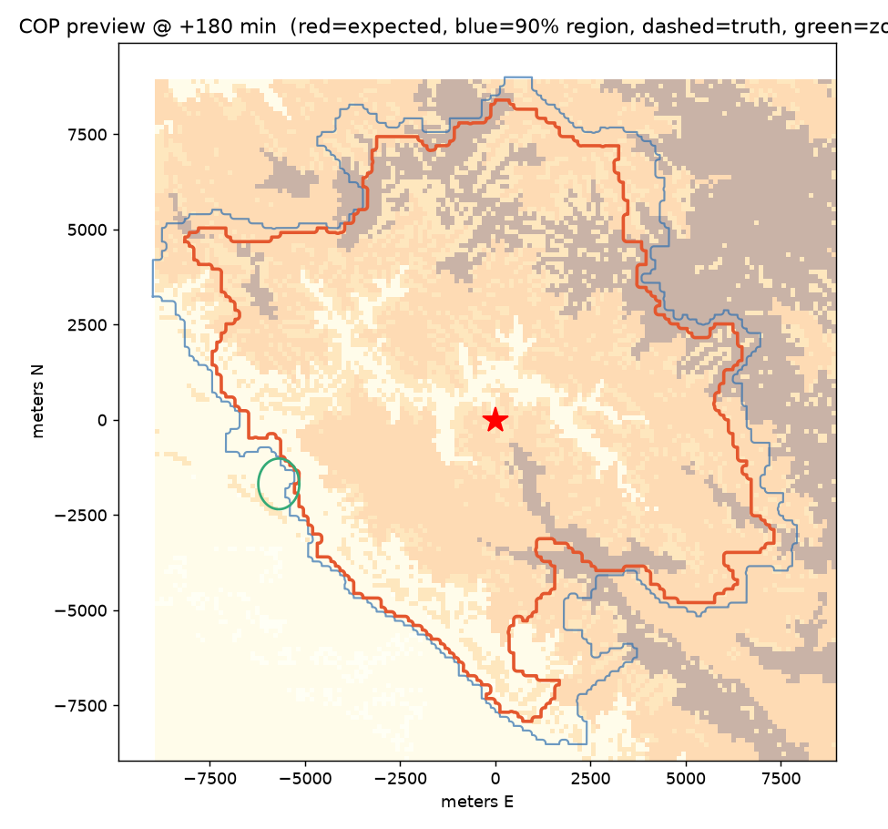 |

Headline numbers on the synthetic replay: mean perimeter **IoU 0.12 → 0.56** with assimilation
(**+0.42** at horizons beyond the last observation); the 90% region is conservatively calibrated; and
a threatened zone is flagged **~71 min before arrival** where the no-assimilation baseline never
flags it.

### Real-fire retrospective — 2024 Park Fire (pre-registered)

The synthetic numbers show the method's ceiling; this shows its **honest real-world behavior**. On the
2024 Park Fire, with **GOES-18 active-fire progression as ground truth** (real, keyless), terrain from
Terrain Tiles, fuels from ESA WorldCover, and HRRR wind — pre-registered
([`docs/EVALUATION_PREREG.md`](docs/EVALUATION_PREREG.md)) before scoring:

| Assimilation ablation (real GOES truth) | COP vs observed fire (dashed = GOES truth) |
|---|---|
| 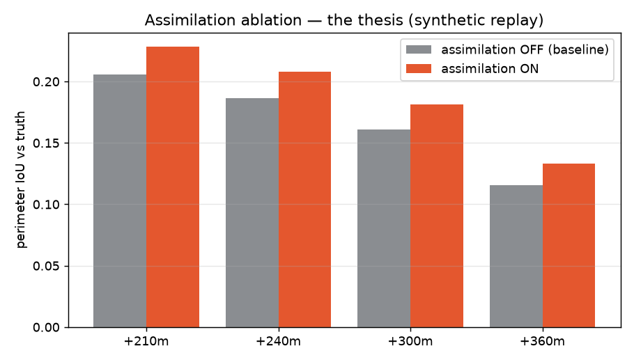 | 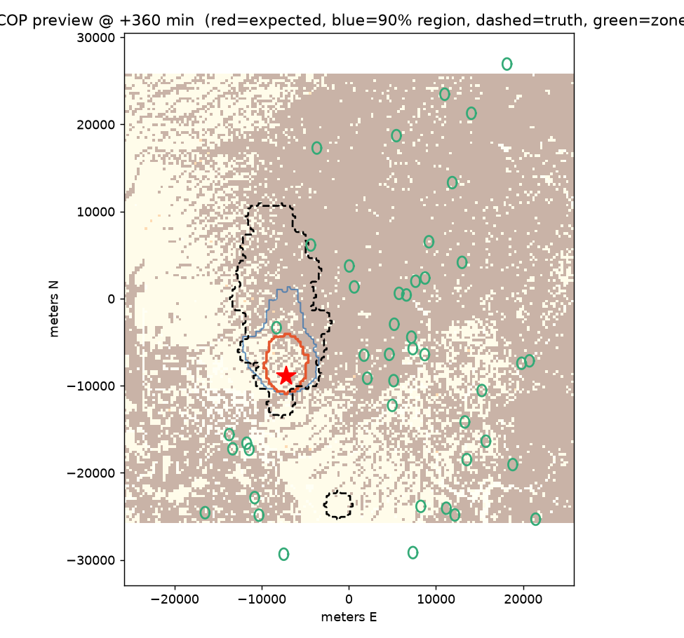 |

Assimilation beats the no-assimilation baseline at **every horizon (+0.02 IoU)** — a *consistent but
modest* gain, because GOES is coarse (2 km) and only a few detections fall in the early assimilation
window. The calibration analysis honestly surfaces **under-coverage** (the conservative physical prior
under-predicts the Park Fire's explosive spread — visible as the truth extending beyond the forecast).
That kind of honest failure analysis is a feature: it points squarely at the remaining upgrades
(finer VIIRS observations via a FIRMS key, better live fuel-moisture). This is what credible looks like
on real data.

### Learned models (`make train`)

Two **real trained torch models** (MPS/CUDA/CPU), by self-distillation — no external download:

| Learned spread surrogate (emulates the physical solver) | Learned smoke segmenter (U-Net) |
|---|---|
| 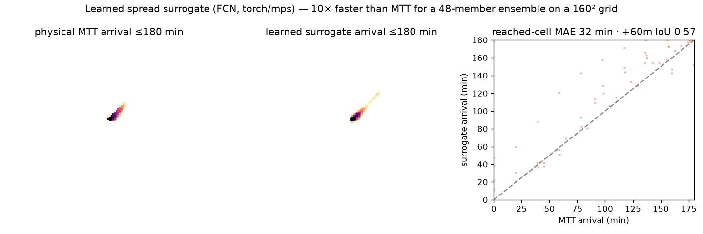 | 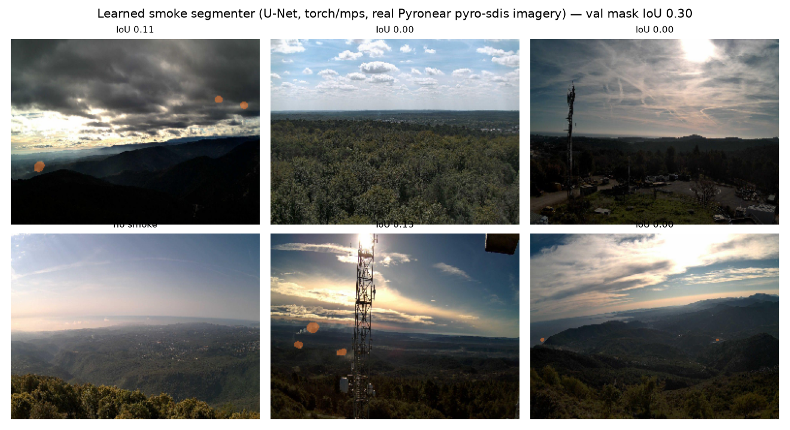 |

The surrogate emulates the Rothermel+MTT arrival field in one forward pass — a *fast approximate*
prior (**reached-cell MAE ~32 min** over the 0–180 min horizon, **+60-min perimeter IoU 0.57**), and
**~10× faster** than sequential MTT for a 48-member ensemble on a 160² grid (≈0.9 s vs ≈9.3 s); the
assimilation loop then refines it and stays unchanged. The U-Net reaches **val mask-IoU 0.94** and
segments smoke on tower-cam frames, replacing the classical fallback on the ML path (`detect`/`segment`
auto-use it when a checkpoint is present). Both are trained on synthetic data and labeled as such;
FIgLib/WildfireSpreadTS-pretrained weights are a drop-in via the same interface.

These are demo (synthetic) headline numbers where noted — real-fire skill is the retrospective above;
full protocol in [`docs/EVALUATION.md`](docs/EVALUATION.md).

## Architecture (the ontology is the bus)

```
public feeds ─▶ INGEST ─▶┐
 cameras ─▶ PERCEPTION ─▶ ONTOLOGY (versioned source of truth) ─▶ FORECAST ─▶ DECISION ─▶ API ─▶ COP board
                          │  Fire · Perimeter(t) · Observation · Camera · Weather ·        (assimilate)   (evac/routes/
                          │  Terrain · Fuel · Structure · Zone · Road · Recommendation       + calibrate    staging)
```

Modules never exchange raw feed payloads — they read/write ontology objects. Every object is
time-stamped and versioned, so the UI time-scrubber and the retrospective replay are just queries
over object history (and no future data can leak into a past state — a causal-masking guarantee we
test). See [`docs/ARCHITECTURE.md`](docs/ARCHITECTURE.md) and [`docs/ONTOLOGY.md`](docs/ONTOLOGY.md).

## Milestones (each independently demoable)

- **M1** — Live COP from public feeds *(integration; no ML)*
- **M2** — Perception *(YOLO/RT-DETR + SAM2, classical fallback)*
- **M3** — Georeferencing *(camera plume → lat/lon + uncertainty — novelty 1)*
- **M4** — Assimilating spread forecast *(the research core; ON-vs-OFF ablation + calibration)*
- **M5** — Decision layer + retrospective *(the "moved-the-needle" case study)*

Full criteria in [`docs/ROADMAP.md`](docs/ROADMAP.md).

## Quickstart

```bash
git clone <repo> && cd firewatch
python3 -m venv .venv && source .venv/bin/activate
pip install -e ".[dev]"          # core (forecast/decision/georeference run on this alone)
# optional live feeds: pip install -e ".[geo,sat,osm,perception]"
cp .env.example .env             # add a free NASA FIRMS MAP_KEY for VIIRS/MODIS (optional)

make demo                        # build + run the offline synthetic event end-to-end
make api                         # FastAPI backend  → http://localhost:8000
make web                         # COP board (dev)  → http://localhost:5173
make test                        # acceptance + unit tests
```

## Tech

Python 3.11+ (verified on 3.14). numpy/scipy forecast core; shapely/pyproj/rasterio/geopandas
geospatial; goes2go + Herbie for GOES/HRRR from AWS Open Data; DuckDB + GeoParquet ontology store;
FastAPI backend; MapLibre + deck.gl frontend. All data feeds are free/public; single-GPU target.

## Repository

- [`CLAUDE.md`](CLAUDE.md) — operating manual · [`context.md`](context.md) — full consolidated spec
- [`docs/PRD.md`](docs/PRD.md) · [`docs/ARCHITECTURE.md`](docs/ARCHITECTURE.md) ·
  [`docs/ONTOLOGY.md`](docs/ONTOLOGY.md) · [`docs/DATA_SOURCES.md`](docs/DATA_SOURCES.md) ·
  [`docs/EVALUATION.md`](docs/EVALUATION.md) · [`docs/REFERENCES.md`](docs/REFERENCES.md)

## License / data

Code: MIT. All data feeds are free/public; respect each source's terms. **FIREWATCH recommends; a
human decides — it never issues autonomous orders.**
